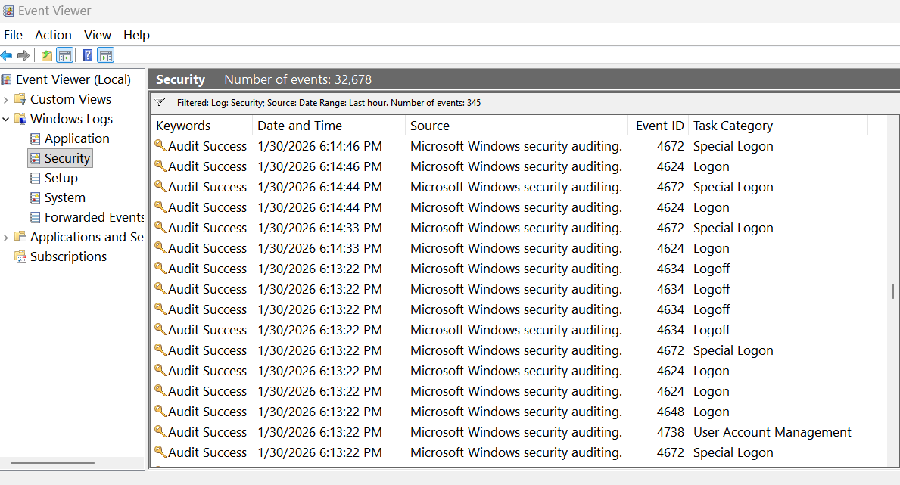
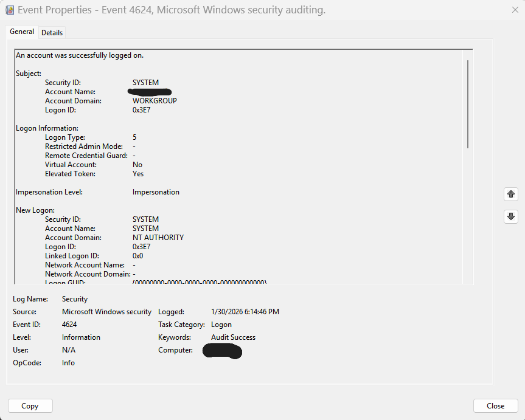
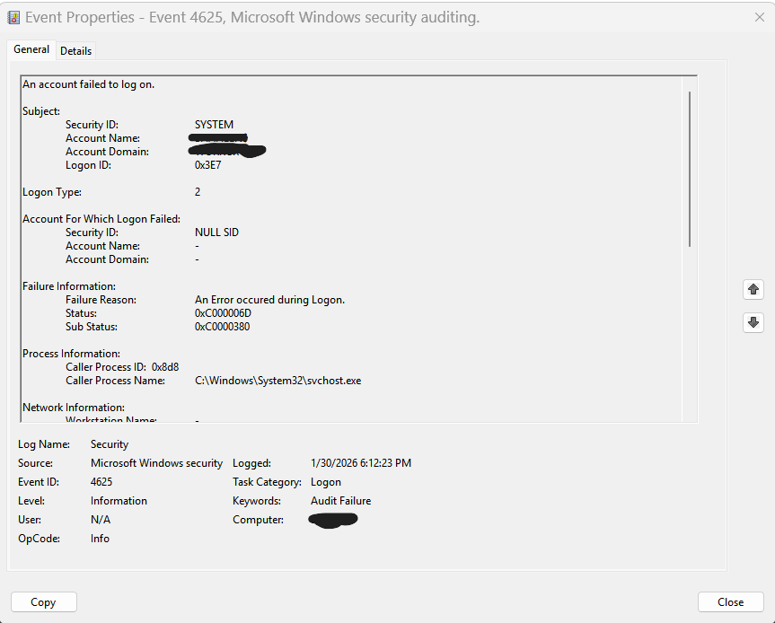
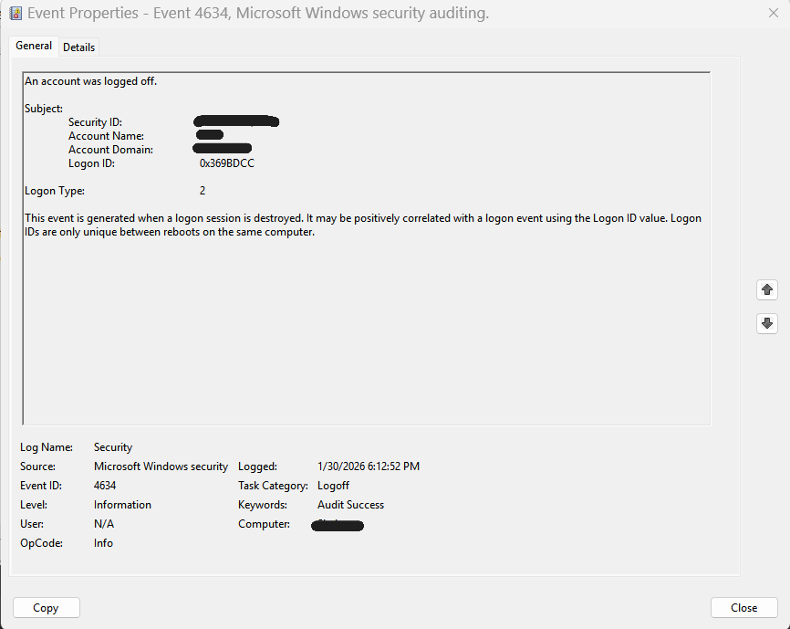

# Windows Authentication Security Analysis

## Project Overview
This project demonstrates hands-on analysis of Windows authentication-related security events using native Windows Security logs. The objective is to simulate real SOC analyst workflows by identifying, validating, and interpreting authentication activity while maintaining operational security and data privacy.

The analysis focuses on logon success, authentication failures, privilege usage, and session termination to detect potential unauthorized access attempts.

---

## Tools & Technologies
- Windows Event Viewer
- Windows Security Event Logs
- MITRE ATT&CK Framework

---

## Events Analyzed
| Event ID | Description |
|--------|------------|
| 4624 | Successful logon |
| 4625 | Failed logon attempt |
| 4634 | Logoff event |
| 4672 | Special privileges assigned to logon |

---

## Analysis Workflow & Evidence

### 1️⃣ Security Log Filtering View

**What this shows:**  
Filtered Windows Security logs displaying authentication-related events. This view is used by SOC analysts to quickly isolate relevant activity such as logons, failures, and privilege assignments from large log volumes.

**Why it matters:**  
Efficient filtering is critical in SOC environments where analysts must triage thousands of events daily.

---

### 2️⃣ Successful Logon Event (Event ID 4624)

**What this shows:**  
A detailed view of a successful authentication event, including logon type and authentication mechanism.

**Why it matters:**  
Event 4624 is used to establish baseline user behavior and confirm valid account usage. It also helps identify suspicious successful logons following repeated failures.

**MITRE ATT&CK:**  
- T1078 – Valid Accounts

---

### 3️⃣ Failed Logon Attempt (Event ID 4625)

**What this shows:**  
A failed authentication attempt indicating incorrect credentials or unauthorized access attempts.

**Why it matters:**  
Repeated 4625 events are a strong indicator of brute-force or password spraying activity and often precede successful compromise.

**MITRE ATT&CK:**  
- T1110 – Brute Force

---

### 4️⃣ Logoff Event (Event ID 4634)

**What this shows:**  
A user session termination event confirming logoff activity.

**Why it matters:**  
Logoff events help analysts track session lifecycles and build accurate timelines during investigations.

---

## Key Security Findings
- Failed authentication attempts indicate potential brute-force behavior.
- Successful logons were correlated to establish baseline access patterns.
- Logoff events confirm session lifecycle completion.
- Event correlation enables timeline-based threat analysis.

---

## SOC Analyst Value
This project demonstrates:
- Authentication log triage
- Threat detection using native Windows logs
- Event correlation and timeline analysis
- Secure evidence handling without exposing credentials or system identity

---

## Data Protection Notice
All screenshots were sanitized to remove usernames, domains, hostnames, and identifiers while preserving analytical value.

---

## Conclusion
This project reflects real-world SOC analyst practices by focusing on detection logic, investigation workflow, and secure documentation rather than artificial lab automation.
